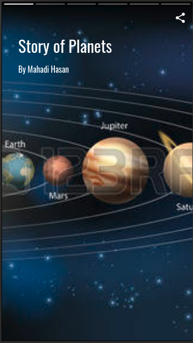
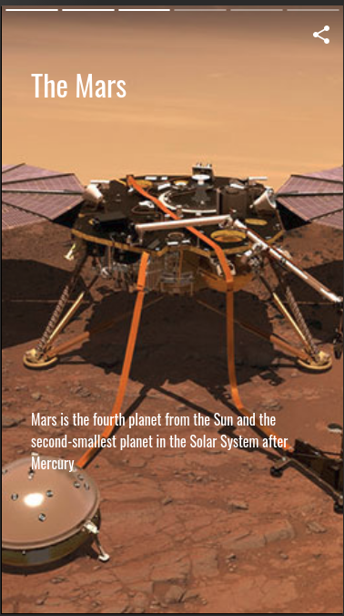
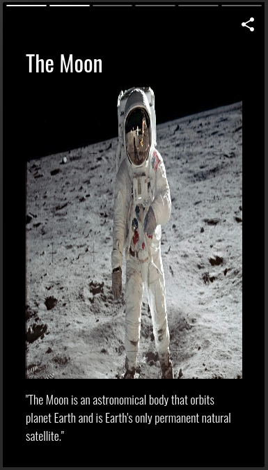
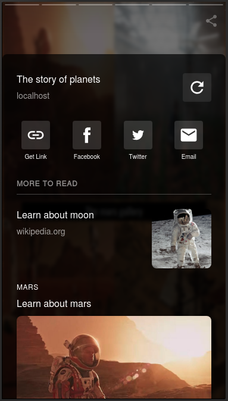
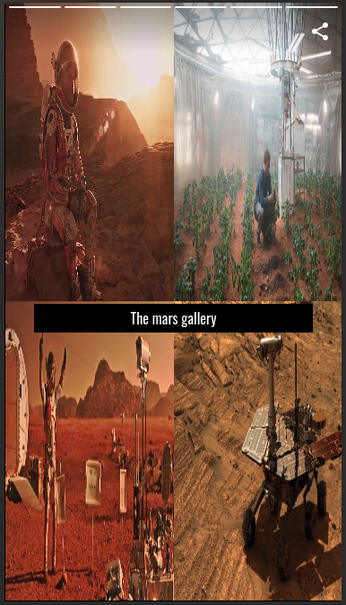
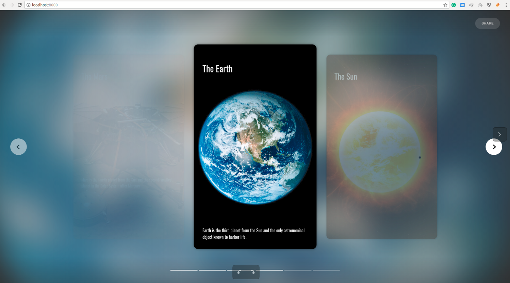

# AMP Planets Story
This is a demo app (Story of planets) using [AMP](https://www.ampproject.org/docs/) and PHP ([Yii Framework](https://www.yiiframework.com/)) technologies.

# Prerequisites
- PHP >= 5.6
- Yii Framework >= 1.6
- Git

# How to run
- Clone from https://github.com/mh2k9/amp-planet-story.git
- Go to amp-planet-story directory
- Run `php -S localhost:8000` 
- On browser hit `http://localhost:8000`

# Demo

